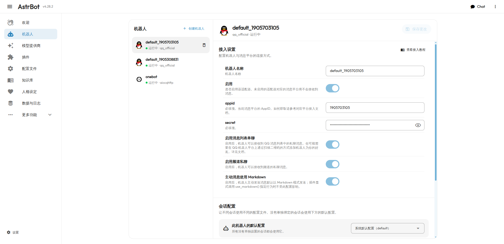
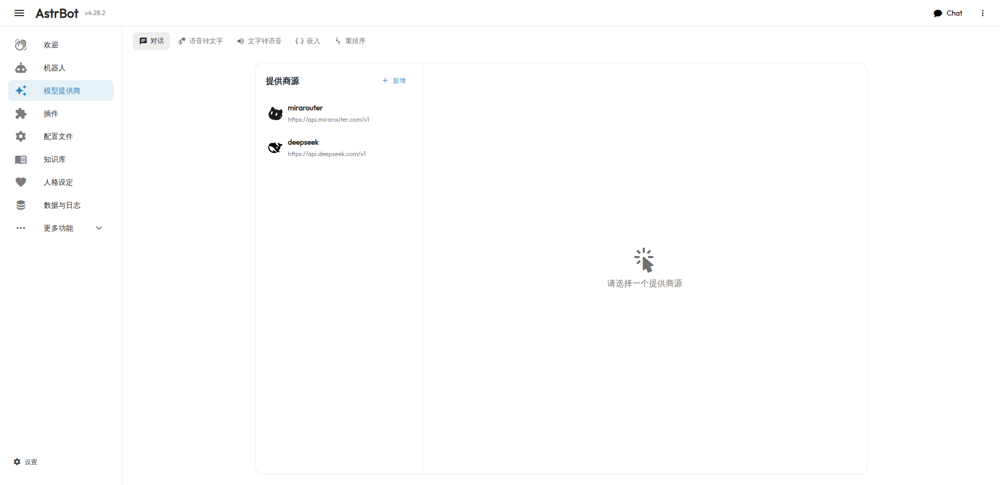

# AstrBot · QQ AI 机器人

基于 [AstrBot](https://github.com/AstrBotDevs/AstrBot) 开源框架部署的 QQ 智能聊天机器人，接入 DeepSeek 大语言模型，提供 AI 角色扮演与日常对话陪伴。

> 本仓库是 AstrBot 的部署与配置工程，包含容器化部署方案、使用文档与截图。

## ✨ 功能特性

- **AI 角色扮演**：支持自定义人格设定，可导入酒馆（SillyTavern）人物卡，进行沉浸式角色互动
- **多平台接入**：同时接入 QQ 官方机器人（`qq_official`）与 OneBot 协议（NapCat）
- **大模型驱动**：接入 DeepSeek，支持多轮上下文对话
- **Agent 能力**：可调用工具执行查询、问答等任务
- **可视化后台**：内置 WebUI 仪表盘，管理人格、插件、知识库、定时任务等

## 🧱 技术栈

| 组件 | 作用 |
| --- | --- |
| [AstrBot](https://github.com/AstrBotDevs/AstrBot) | 多平台 LLM 聊天机器人框架 |
| DeepSeek | 大语言模型（`deepseek-chat`） |
| [NapCat](https://github.com/NapNeko/NapCatQQ) | QQ 协议端（OneBot 标准） |
| Docker | 容器化部署 |

## 🏗️ 架构

```
┌─────────┐    OneBot WS :6199    ┌──────────┐     HTTP     ┌──────────┐
│   QQ    │ ────────────────────► │  AstrBot │ ───────────► │ DeepSeek │
│  用户    │ ◄─────────────────── │  (核心)  │ ◄─────────── │   LLM    │
└─────────┘                       └──────────┘             └──────────┘
                                     │
                                     │ :6185 (WebUI)
                                     ▼
                             ┌──────────────┐
                             │  管理后台      │
                             │ 人格/插件/知识库│
                             └──────────────┘
```

## 🚀 快速开始

### 环境要求

- Docker / Docker Compose
- 一个可用的 QQ 机器人（QQ 官方机器人平台 或 NapCat）
- DeepSeek API Key

### 部署

```bash
git clone https://github.com/BF-563/AstrBot.git
cd AstrBot
docker compose up -d
```

启动后访问 `http://<服务器IP>:6185` 打开 WebUI，依次完成：

1. 配置模型提供商（DeepSeek）
2. 配置消息平台（QQ 官方 / OneBot）
3. 设置人格（可选，从酒馆导入人物卡）

## 📸 界面截图

**平台管理** — QQ 官方机器人与 OneBot 适配器运行状态



**模型提供商** — 已接入 DeepSeek



## 📁 目录结构

```
AstrBot/
├── docker-compose.yml    # 容器化部署配置
├── data/                 # 运行时数据（不入库，见 .gitignore）
└── assets/screenshots/   # 界面截图
```

## 📄 许可证

本仓库为 [AstrBot](https://github.com/AstrBotDevs/AstrBot) 的部署配置与文档。AstrBot 本身遵循 AGPLv3 协议，详见其[官方仓库](https://github.com/AstrBotDevs/AstrBot)。
